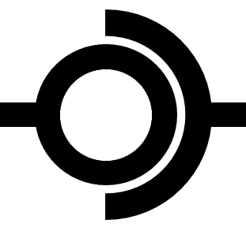

<a name="readme-top"></a>
<!--
*** This readme is written based on Best-README-Template.
-->

<!-- PROJECT SHIELDS -->

<!-- PROJECT LOGO -->
<br />
<div align="center">
  <a href="https://github.com/ZHBHFUT/EasyFsi">
    
  </a>

  <h3 align="center">EasyFsi Library</h3>

  <p align="center">
    An awesome toolkit for solving FSI or multi-physics coupling problem!
    <br />
    <a href="https://github.com/ZHBHFUT/EasyFsi"><strong>Explore the docs »</strong></a>
    <br />
    <br />
    <a href="https://github.com/ZHBHFUT/EasyFsi">View Demo</a>
    ·
    <a href="https://github.com/ZHBHFUT/EasyFsi/issues">Report Bug</a>
    ·
    <a href="https://github.com/ZHBHFUT/EasyFsi/issues">Request Feature</a>
  </p>
</div>

<!-- TABLE OF CONTENTS -->
<details>
  <summary>Table of Contents</summary>
  <ol>
    <li>
      <a href="#about-the-project">About The Project</a>
      <ul>
        <li><a href="#built-with">Built With</a></li>
      </ul>
    </li>
    <li>
      <a href="#getting-started">Getting Started</a>
      <ul>
        <li><a href="#prerequisites">Prerequisites</a></li>
        <li><a href="#installation">Installation</a></li>
      </ul>
    </li>
    <li><a href="#usage">Usage</a></li>
    <li><a href="#roadmap">Roadmap</a></li>
    <li><a href="#contributing">Contributing</a></li>
    <li><a href="#license">License</a></li>
    <li><a href="#contact">Contact</a></li>
    <li><a href="#acknowledgments">Acknowledgments</a></li>
  </ol>
</details>

<!-- ABOUT THE PROJECT -->
## About The Project

TBD

<p align="right">(<a href="#readme-top">back to top</a>)</p>

### Built With

* [![Visual Studio]][visualstudio-url]
* [![pybind11]][pybind11-url]

<p align="right">(<a href="#readme-top">back to top</a>)</p>


<!-- GETTING STARTED -->
## Getting Started

This is an example of how you may give instructions on setting up your project locally.
To get a local copy up and running follow these simple example steps.

### Prerequisites

This is an example of how to list things you need to use the software and how to install them.
* We need nothing

### Installation

_Below is an example of how you can instruct your audience on installing and setting up your app. This template doesn't rely on any external dependencies or services._

1. Install Visual Studio with C++20
2. Install pybind11 if you need python binding
3. Clone the repo
   ```sh
   git clone https://github.com/ZHBHFUT/EasyFsi.git
   ```
4. Open `EasyFsi.sln` and build all projects.
5. Include `EasyFsi.h` to your C/C++ project, see `example.cpp`.
6. Use `import EasyFsi` in your python script, see `example.py`.

<p align="right">(<a href="#readme-top">back to top</a>)</p>

<!-- USAGE EXAMPLES -->
## Usage

See `example.cpp` and `example.py` to find out how to use this library.

<p align="right">(<a href="#readme-top">back to top</a>)</p>

<!-- ROADMAP -->
## Roadmap

- [ ] Add Changelog
- [ ] Add MATLAB binding
- [ ] Implement the `CoupledRegion` class
- [ ] Add additional interpolation method
- [ ] Add document

See the [open issues](https://github.com/ZHBHFUT/EasyFsi/issues) for a full list of proposed features (and known issues).

<p align="right">(<a href="#readme-top">back to top</a>)</p>

<!-- CONTRIBUTING -->
## Contributing

Contributions are what make the open source community such an amazing place to learn, inspire, and create. Any contributions you make are **greatly appreciated**.

If you have a suggestion that would make this better, please fork the repo and create a pull request. You can also simply open an issue with the tag "enhancement".
Don't forget to give the project a star! Thanks again!

1. Fork the Project
2. Create your Feature Branch (`git checkout -b feature/AmazingFeature`)
3. Commit your Changes (`git commit -m 'Add some AmazingFeature'`)
4. Push to the Branch (`git push origin feature/AmazingFeature`)
5. Open a Pull Request

<p align="right">(<a href="#readme-top">back to top</a>)</p>

<!-- LICENSE -->
## License

Distributed under the MIT License. See `LICENSE.txt` for more information.

<p align="right">(<a href="#readme-top">back to top</a>)</p>

<!-- CONTACT -->
## Contact

ZHANG Bing - zhangbing@hfut.edu.cn

Project Link: [https://github.com/ZHBHFUT/EasyFsi](https://github.com/ZHBHFUT/EasyFsi)

<p align="right">(<a href="#readme-top">back to top</a>)</p>

<!-- ACKNOWLEDGMENTS -->
## Acknowledgments

TBD

<p align="right">(<a href="#readme-top">back to top</a>)</p>

<!-- MARKDOWN LINKS & IMAGES -->
<!-- https://www.markdownguide.org/basic-syntax/#reference-style-links -->
[license-shield]: https://github.com/ZHBHFUT/EasyFsi/images/LICENSE-MIT.svg?style=for-the-badge
[license-url]: https://mit-license.org/
[visualstudio-img]: https://visualstudio.microsoft.com/wp-content/uploads/2021/10/Product-Icon.svg
[visualstudio-url]: https://visualstudio.microsoft.com
[pybind11-img]:https://github.com/pybind/pybind11/raw/master/docs/pybind11-logo.png
[pybind11-url]:https://github.com/pybind/pybind11
